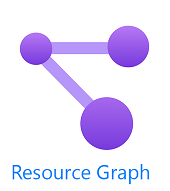

# Azure Resource Graph Examples

<!--  -->

<!--  -->

This is just a quick post. I am slowly working on building a collection of Resource Graph Queries - they can be found [here](https://github.com/fskelly/azure-resource-graph/tree/main/enterpriseScale) and will grow over time. It just takes some time to build these.

They will be broken down into a folder structure based upon the [Critical Design Areas of Enterprise Scale Landing Zone](https://docs.microsoft.com/en-us/azure/cloud-adoption-framework/ready/enterprise-scale/design-guidelines)

Hope this helps and keep an eye out for more.

Follow me for more.  
[Twitter](https://twitter.com/fskelly)
[LinkedIn](https://www.linkedin.com/in/fletcherkelly/)
